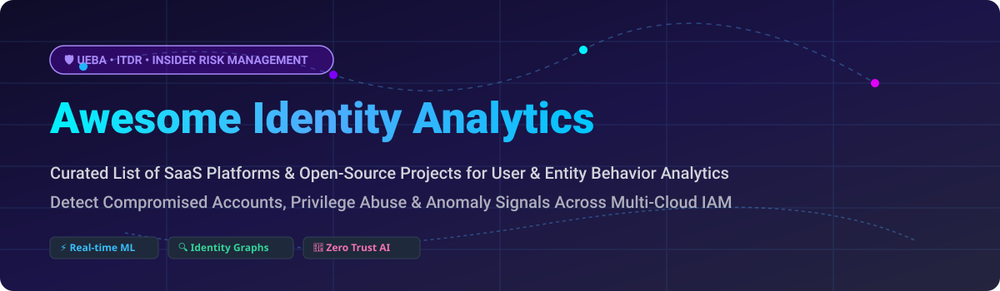

  

      

# 🛡️ Awesome Identity Analytics

> **Curated List of SaaS Platforms & Open-Source Projects for User & Entity Behavior Analytics (UEBA), Identity Threat Detection & Response (ITDR) & Insider Risk Management.**

Welcome to **Awesome Identity Analytics**! This repository tracks premier SaaS products and active open-source projects for identity security analytics. These tools empower SOC teams, security engineers, and threat hunters to establish behavioral baselines, detect compromised credentials, mitigate insider threats, and prevent privilege escalation across cloud, SaaS, and on-premises environments.

---

## 📚 Table of Contents

- [📊 Market Overview](#-market-overview)
- [🏢 SaaS & Hosted Enterprise Platforms](#-saas--hosted-enterprise-platforms)
- [🔓 Open-Source GitHub Projects](#-open-source-github-projects)
- [🤝 How to Contribute](#-how-to-contribute)
- [💖 Support & Community](#-support--community)
- [📈 Star History](#-star-history)
- [⚠️ Disclaimer](#%EF%B8%8F-disclaimer)

---

## 📊 Market Overview

> 💡 **Market Size & Industry Structure:** The global Identity Analytics and User & Entity Behavior Analytics (UEBA) sector is estimated at **$2.6B – $4.3B in 2026** and projected to exceed **$10B+ by 2033** with a **25%–35% CAGR**. The market is currently **moderately fragmented with active consolidation**, featuring a blend of hyper-scaler security suites (Microsoft, Palo Alto Networks) alongside specialized best-of-breed UEBA & ITDR platforms (Varonis, Exabeam, Securonix).

---

## 🏢 SaaS & Hosted Enterprise Platforms

The following enterprise platforms provide managed, AI-driven UEBA and ITDR security capabilities. *Entries are sorted by parent company size / valuation / market capitalization in descending order.*

| 🏢 Platform | 📝 Description | 💼 Company Size / Valuation / Revenue | 💰 Starting Price | 🎁 Free Tier / Trial Limits |
| :--- | :--- | :--- | :--- | :--- |
| **[Microsoft Defender for Identity & Sentinel](https://microsoft.com)** | Cloud-native SIEM & ITDR monitoring Active Directory & Entra ID signals to block lateral movement and credential compromise. | Public ($3.3T Market Cap; $20B+ Security Segment Revenue) | Sentinel: $2.46 – $4.30 per GB ingested; Defender: $5.20/user/month | 30-day Microsoft Sentinel trial with 10 GB/day data ingestion free; 90-day M365 E5 trial |
| **[IBM QRadar UBA / Palo Alto Networks](https://paloaltonetworks.com)** | User Behavior Analytics platform establishing baseline time-series anomaly detection and risk scoring across enterprise logs. | Public / Acquired ($110B Palo Alto Market Cap; $2.5B+ IBM Security Segment) | ~$10,400/year base QRadar SIEM subscription (UBA app module is free add-on) | 14-day QRadar Virtual Appliance free trial capped at 50 EPS |
| **[Varonis](https://www.varonis.com)** | Data security platform with UEBA profiling permissions, file access, and user actions to prevent insider threats and exfiltration. | Public (NASDAQ: VRNS, ~$5.45B Market Cap; $688M TTM Revenue) | ~$15/user/month (~$1,800/year base platform subscription) | 30-day Data Risk Assessment free trial with complete automated directory audit |
| **[Darktrace Identity](https://darktrace.com)** | Self-learning AI module detecting anomalous user and entity behavior across multi-cloud and SaaS directory infrastructure. | Acquired ($5.3B Acquisition Valuation by Thoma Bravo; ~$690M Revenue) | ~$30,000/year (~$2,500/month) base enterprise tier | 30-day Proof of Value (POV) trial running live on production traffic |
| **[Exabeam & LogRhythm](https://www.exabeam.com)** | Security intelligence platform using behavioral baselines and automated risk scoring to detect account takeovers and privilege abuse. | Private ($2.4B Valuation; Series F $200M round; ~$268M combined revenue) | ~$25,000/year base cloud tier license | 30-day guided interactive cloud sandbox trial with sample telemetry dataset |
| **[ObserveIT (Proofpoint ITM)](https://www.proofpoint.com)** | Insider threat management platform recording user sessions and evaluating activity to block unauthorized data exfiltration. | Private / Acquired (Part of Proofpoint / Thoma Bravo; ~$1.2B Parent Revenue) | ~$12/monitored user/month (minimum 100 users = ~$14,400/year base) | 14-day hosted Proofpoint ITM sandbox trial for up to 25 endpoint agents |
| **[Securonix](https://www.securonix.com)** | Next-gen SIEM with cloud-native UEBA leveraging machine learning models to detect advanced insider risks and zero-day threats. | Private ($1.0B+ Unicorn Valuation; $1B growth investment by Vista Equity) | ~$30,000/year enterprise base cloud deployment license | 14-day cloud sandbox trial pre-loaded with threat detection models |
| **[ManageEngine Log360](https://www.manageengine.com/log-management/)** | Integrated SIEM with UEBA using Markov Chains and predictive risk scoring for real-time user behavior anomaly detection. | Private (Zoho Corporation Division; $1.0B+ Zoho Group Revenue) | $245/year (On-Premises base for 10 log sources) / $1,095/year (Cloud base) | Free Edition available forever for up to 25 log sources; 30-day Cloud trial |

---

## 🔓 Open-Source GitHub Projects

Open-source identity analytics engines allow security operations teams to deploy transparent detection logic, host custom ML models, and maintain data sovereignty without vendor lock-in. *Entries are sorted by GitHub Stars_Counts in descending order.*

*   ### 🛡️ **[Azure Sentinel Detection & UEBA Rules](https://github.com/Azure/Azure-Sentinel)** 
    Official community repository containing detection rules, KQL queries, and UEBA anomaly analytics models for cloud identity monitoring.

*   ### 🔑 **[Baton Identity Governance Toolkit](https://github.com/ConductorOne/baton)** 
    Open-source identity governance toolkit to extract, normalize, and audit user permissions, roles, and access paths across SaaS and IaaS infrastructure.

*   ### 🏛️ **[Evolveum MidPoint](https://github.com/Evolveum/midpoint)** 
    Comprehensive open-source Identity Governance and Administration (IGA) system supporting automated user provisioning, identity synchronization, and compliance auditing.

*   ### 🔬 **[OpenUBA Framework](https://github.com/GACWR/OpenUBA)** 
    Modular UEBA framework featuring managed JupyterLab workspaces, a Python SDK (`pip install openuba`), visual Rule Canvas, and ML model libraries (PyTorch, TensorFlow, NetworkX).

*   ### 🤖 **[ThreatFlix AI Security Copilot](https://github.com/threatflix/threatflix)** 
    AI-powered security copilot SDK utilizing Google Gemini and MITRE ATT&CK for UEBA ensemble modeling, graph similarity analysis, and deterministic attack chain narration.

*   ### 🕸️ **[Idryx Identity Security Graph](https://github.com/idryx/idryx)** 
    Identity Security Graph unifying human accounts, service principals, and AI agents into a single graph with 27 ITDR detectors and delegation chain resolution.

*   ### 🔍 **[OpenSearch Security Analytics](https://github.com/opensearch-project/security-analytics)** 
    Automated threat detection and security analytics plugin for OpenSearch supporting Sigma rule execution and user anomaly detectors.

*   ### ⚡ **[Microsoft ITDR Detection Engine](https://github.com/nicolonsky/ITDR)** 
    Curated detection modules and PowerShell playbooks designed for Microsoft Entra ID and Active Directory Identity Threat Detection & Response.

*   ### 🔗 **[UEBA Blockchain Ledger](https://github.com/variationalkk/UEBA-Blockchain-Ledger)** 
    Machine-learning anomaly detection system pairing Isolation Forest models with a hash-chained blockchain audit log for tamper-proof security alerts.

---

## 🤝 How to Contribute

Contributions from security researchers, SOC analysts, and identity engineers are warmly welcome! 

1. **Fork** this repository.
2. Create a feature branch (`git checkout -b add-new-identity-tool`).
3. Update `README.md` with factual descriptions, official documentation links, and proper category placement.
4. Open a **Pull Request** explaining your addition.

---

## 💖 Support & Community

Thank you for exploring and supporting **Awesome Identity Analytics**! If you find this resource helpful for your security team, SOC investigations, or research, please consider supporting the project:

- 🌟 **Star** this repository on GitHub to increase its visibility.
- 🔀 **Fork** and contribute your own identity security insights and tools.
- 📢 **Share** this list with fellow security engineers and threat hunters on Twitter/X, LinkedIn, and Reddit.
- ☕ **Sponsor the Maintainer:** If you'd like to support ongoing open-source maintenance, consider [buying a coffee on GitHub Sponsors](https://github.com/sponsors/ishandutta2007).

---

## 📈 Star History

---

## ⚠️ Disclaimer

This repository is a community-curated collection intended for educational and informational security research purposes only. Identity analytics tools process highly sensitive telemetry; users must ensure full compliance with regional employee privacy laws, GDPR/CCPA regulations, and enterprise security policies prior to deployment.
